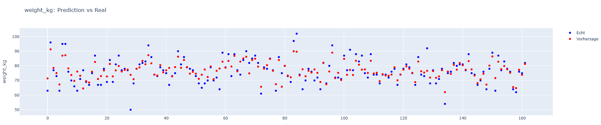
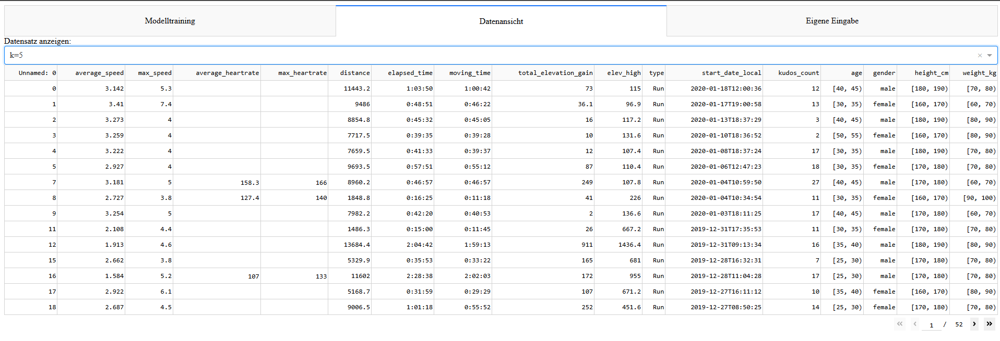
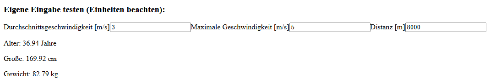

# 🛡️ Strava-Daten Rekonstruktionsangriff

Diese interaktive Web-App demonstriert, wie sensible demografische Daten (Alter, Gewicht, Größe) aus scheinbar anonymisierten Fitnessdaten rekonstruiert werden können – durch den Einsatz von Machine Learning.

---

## 📁 Projektstruktur

- `strava_dash_anonymisierung_app.py` – vollständiger Python-Code der Dash-Anwendung
- `strava_with_demographics.csv` – Originaldaten mit demografischen Angaben
- `strava_anonymized_k2.csv` / `k5` / `k20` / `k50` – k-anonymisierte Versionen des Datensatzes

> Hinweis: Die k-Anonymisierung wurde **extern durchgeführt** (z. B. mit ARX) und ist **nicht Teil des Python-Codes**.

---

## ⚙️ Installation und Ausführung

### 1. Abhängigkeiten installieren
```bash
pip install dash pandas numpy plotly scikit-learn
```

### 2. App starten
```bash
python strava_dash_anonymisierung_app.py
```

Dann öffnet sich die Web-App unter [http://127.0.0.1:8050](http://127.0.0.1:8050)

---

## 💻 Verwendete Technologien & Bibliotheken

- **Dash** – für die interaktive Weboberfläche
- **Plotly** – für die Visualisierung von Vorhersagen
- **Pandas / NumPy** – Datenverarbeitung
- **Scikit-learn** – für das Machine Learning:
  - `RandomForestRegressor` – Regressionsmodell mit Entscheidungsbäumen, das für jede Zielvariable trainiert wird
  - `StandardScaler` – skaliert numerische Eingabedaten (Mittelwert = 0, Standardabweichung = 1) für bessere Modellperformance

---

## 🧠 Machine Learning Modell

Für jede Zielgröße wird ein separates **Random Forest Regressionsmodell** trainiert:

**Zielvariablen (QIDs):**
- `age`
- `height_cm`
- `weight_kg`

**Eingabefeatures:**
- `average_speed`
- `max_speed`
- `distance`
- `total_elevation_gain`
- `elev_high`
- `kudos_count`

Die Features werden vor dem Training mit `StandardScaler` normalisiert.

---

## 🖥️ Aufbau der Benutzeroberfläche (UI)

Die Web-App ist in 3 Tabs gegliedert:

### 1. Modelltraining
- Prozentsatz nicht anonymisiertern Trainingsdaten wählbar (Slider)
- Anzahl der Random-Forest-Bäume einstellbar
- Nach Training: Auswahl eines anonymisierten Datensatzes und Angriff starten
- **Ausgabe:**
  - **Tabelle** mit MAE und Prozent-Abweichungen (≤2%, ≤5%, …)
  - **Diagramme**:
    - **X-Achse**: Index der Datenzeile
    - **Y-Achse**: Wert der Zielvariablen (z. B. Alter in Jahren)
    - Rot = Vorhersage, Blau = Echtdaten
    


### 2. Datenansicht
- CSV-Datensätze können direkt in der App durchstöbert werden



### 3. Eigene Eingabe
- Nutzer gibt `average_speed`, `max_speed` und `distance` (metrisch) manuell ein
- App zeigt geschätztes Alter, Größe und Gewicht an



---

## 🎯 Ziel der App

Die Anwendung zeigt exemplarisch, wie selbst bei k-Anonymität sensitive personenbezogene Informationen durch Machine Learning **rekonstruiert** werden können – ein zentrales Problem im Datenschutz und der Datenfreigabe.

---

## 👤 Autor

**Oliver Stech**  
Matrikelnummer: 3770641  
Universität Leipzig – Master Informatik  
📧 E-Mail: [oliver@stech.at](mailto:oliver@stech.at)

---

> Erstellt im Rahmen des Seminars **„Aktuelle Datenschutzverfahren aus der Forschung“**
